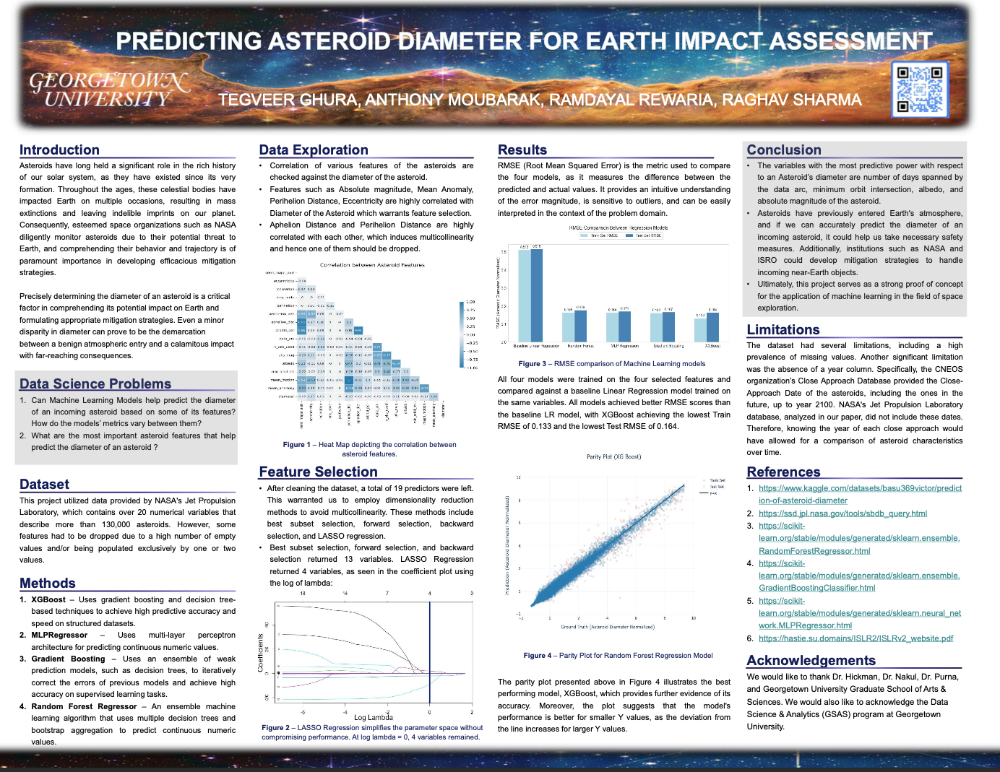

# 512-project-group-24

Below is a snippet of the poster (present in repo as well) that explains the whole project:

## Databases:

1. [Small-Body Database Query (Jet Propulsion Laboratory, California Institute of Technology)](https://ssd.jpl.nasa.gov/tools/sbdb_query.html)
2. [NEO Earth Close Approaches, CNEOS](https://cneos.jpl.nasa.gov/ca/)
